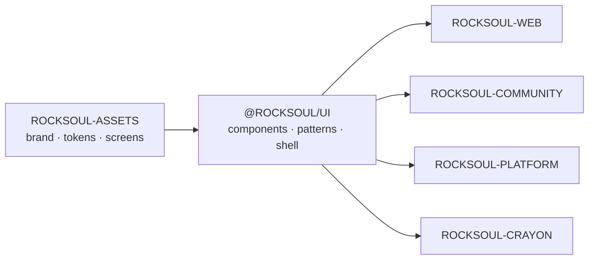

<div align="center">


# ROCKSOUL UI

## **THE IMPLEMENTATION GRAMMAR**

### **DESIGN ONCE. IMPLEMENT CONSISTENTLY.**

Production-oriented, code-first UI system for the **MoonWitness × Rocksoul** product ecosystem.


[Design Source](https://github.com/bjo163/rocksoul-assets) · [Public Web](https://github.com/bjo163/rocksoul-web) · [Community](https://github.com/bjo163/rocksoul-community) · [Platform](https://github.com/bjo163/rocksoul-platform) · [Console](https://github.com/bjo163/rocksoul-crayon)

</div>

---

> **`rocksoul-assets` defines the visual truth. `@rocksoul/ui` turns that truth into reusable production code. Applications consume it; they do not fork it.**

## Canonical execution SOT

**GitHub Issue #86 — UI-SOT-001** is the canonical execution/release control plane for this repository.

```text
GitHub Issues / PRs
        ↓
#86 UI-SOT-001
        ↓
ROCKSOUL-TODO.json / docs / checklists
        ↓
CI artifacts / release evidence
```

`ROCKSOUL-TODO.json` is a deterministic machine-readable projection. It is not an independent source of truth.

## Canonical chain



## Identity

| Concern | Contract |
|---|---|
| Repository | `rocksoul-ui` |
| Package | `@rocksoul/ui` |
| Product umbrella | **MoonWitness** |
| Connective thread | **Rocksoul** |
| Canonical design source | [`rocksoul-assets`](https://github.com/bjo163/rocksoul-assets) |
| Canonical design tool | **Penpot** |

`rocksoul/ui` is the conceptual path; the valid npm package identity is `@rocksoul/ui`.

## Governance

`rocksoul-ui` uses an npm-only, fail-closed repository contract.

- Canonical package manager: `npm`
- Canonical lockfile: `package-lock.json`
- `dist/` is tracked delivery output and must remain reproducible from source.
- Unknown contract drift blocks CI.
- Release metadata is derived from `package.json`.
- Asset freshness distinguishes approved bookkeeping-only metadata from runtime/asset drift; unknown upstream files block.
- Branch/release governance and release readiness are tracked through GitHub SOT #86.

Run `npm run audit:repository` to verify repository-level invariants.

## Stack

```text
React 19
TypeScript strict
Vite
Tailwind CSS v4
Storybook
Accessibility addon
```

## Visual grammar

The implementation follows the canonical contracts from `rocksoul-assets`:

- semantic color tokens and typography hierarchy;
- Inter Tight direction for display, Inter body, IBM Plex Mono metadata;
- expressive public/community surfaces;
- clean, dense platform/admin surfaces;
- shared responsive application shell;
- visible focus and 44×44 minimum touch targets;
- reduced-motion support;
- status never color-only;
- graph always has a text equivalent;
- correlation always carries explanation;
- legal interpretation never presents itself as a court judgment.

## Surface coverage

| Range | Surface | Primary consumer |
|---|---|---|
| 01–12 | public observatory / research / case / legal | `rocksoul-web` |
| 13–14 | community + authentication | `rocksoul-community` |
| 15 | platform administration | `rocksoul-platform` |
| 16 | design-system reference | `@rocksoul/ui` |
| 17–27 | authenticated shell + workspaces | `rocksoul-crayon` / shared app UI |

## Application framework

`@rocksoul/ui` provides reusable contracts for:

```text
ApplicationShell
AutoMenu sidebar
Topbar
Theme control
Breadcrumbs
Backend status
User menu
Command Palette
Notifications
Dashboard
Kanban
Calendar
Chat
AI Workspace
Profile / Settings
Authorization UX
Loading / Empty / Error states
```

Resource navigation is data-driven through `applicationResources` and AutoMenu. Consuming apps must not duplicate navigation arrays or redefine the design system locally.

## Developer notes

Playwright output under `test-results/` is ephemeral and ignored. CI retains it only as failure artifacts; never commit local traces or screenshots from this directory.

Use the repository contract, architecture rules, package exports, Storybook stories, and GitHub SOT #86 as the executable source of truth for UI changes.
