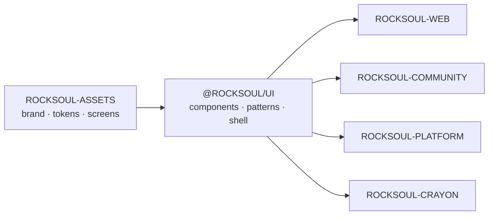

<div align="center">


# ROCKSOUL UI

## **THE IMPLEMENTATION GRAMMAR**

### **DESIGN ONCE. IMPLEMENT CONSISTENTLY.**

Production-oriented, code-first UI system for the **MoonWitness × Rocksoul** product ecosystem.


[Design Source](https://github.com/bjo163/rocksoul-assets) · [Public Web](https://github.com/bjo163/rocksoul-web) · [Community](https://github.com/bjo163/rocksoul-community) · [Platform](https://github.com/bjo163/rocksoul-platform) · [Console](https://github.com/bjo163/rocksoul-crayon)

</div>

---

> **`rocksoul-assets` defines the visual truth. `@rocksoul/ui` turns that truth into reusable production code. Applications consume it; they do not fork it.**

## Canonical chain



## Identity

| Concern | Contract |
|---|---|
| Repository | `rocksoul-ui` |
| Package | `@rocksoul/ui` |
| Product umbrella | **MoonWitness** |
| Connective thread | **Rocksoul** |
| Canonical design source | [`rocksoul-assets`](https://github.com/bjo163/rocksoul-assets) |
| Canonical design tool | **Penpot** |

`rocksoul/ui` is the conceptual path; the valid npm package identity is `@rocksoul/ui`.

## Stack

```text
React 19
TypeScript strict
Vite
Tailwind CSS v4
Storybook
Accessibility addon
```

## Visual grammar

The implementation follows the canonical contracts from `rocksoul-assets`:

- semantic color tokens and typography hierarchy;
- Inter Tight direction for display, Inter body, IBM Plex Mono metadata;
- expressive public/community surfaces;
- clean, dense platform/admin surfaces;
- shared responsive application shell;
- visible focus and 44×44 minimum touch targets;
- reduced-motion support;
- status never color-only;
- graph always has a text equivalent;
- correlation always carries explanation;
- legal interpretation never presents itself as a court judgment.

<div align="center">


</div>

## Surface coverage

| Range | Surface | Primary consumer |
|---|---|---|
| 01–12 | public observatory / research / case / legal | `rocksoul-web` |
| 13–14 | community + authentication | `rocksoul-community` |
| 15 | platform administration | `rocksoul-platform` |
| 16 | design-system reference | `@rocksoul/ui` |
| 17–27 | authenticated shell + workspaces | `rocksoul-crayon` / shared app UI |

## Application framework

`@rocksoul/ui` provides reusable contracts for:

```text
ApplicationShell
AutoMenu sidebar
Topbar
Theme control
Breadcrumbs
Backend status
User menu
Command Palette
Notifications
Dashboard
Kanban
Calendar
Chat
AI Workspace
Profile / Settings
Authorization UX
Loading / Empty / Error states
```

Resource navigation is data-driven through `applicationResources` and AutoMenu. Consuming apps must not duplicate navigation arrays or redefine the design system locally.

### Consumer usage

```tsx
import "@rocksoul/ui/styles.css"
import {
  ApplicationShell,
  DashboardScreen,
  applicationResources,
} from "@rocksoul/ui"
```

Build output:

```text
dist/index.js
dist/index.d.ts
dist/styles.css
dist/brand/*
dist/assets/*
```

React and React DOM remain peer dependencies so the consumer owns the runtime instance.

## Git dependency handoff

```bash
npm install github:bjo163/rocksoul-ui#main
```

Application-specific routing, API clients, authentication providers, persistence, and backend state belong to the consuming application. Reusable visual/application contracts stay in `@rocksoul/ui`.

## Asset synchronization

The repository keeps an explicit recorded sync point to `rocksoul-assets/main` and validates it with:

```text
npm run audit:assets-sync
npm run audit:assets-freshness
```

A newer `rocksoul-assets` commit must be reviewed before UI CI is allowed to claim parity. Generated browser/app/social delivery files are mirrored read-only from canonical SVG-derived assets; edit the source in `rocksoul-assets`, then resynchronize.

## Asset packs v1.2

`@rocksoul/ui 0.9.0` implements the **MoonWitness Complete Asset Packs v1.2.0** contract from `rocksoul-assets@95a6912409f849029e18093658b1c0e8158a32f0`.

- **19** typed asset packs;
- Motion expanded to **12** animated SVG references;
- SFX expanded to **14** deterministic WAV/OGG cues;
- secondary Graph, Badge, Source/File, Geospatial, Cursor, Persona, Social, Platform Delivery, Onboarding, Document/Report, Notification, and Editorial packs;
- `MoonWitnessAssetProvider` resolves canonical app-hosted assets at `/assets/moonwitness`;
- `MoonWitnessAssetImage`, status/persona helpers, and opt-in `useMoonWitnessSfx`;
- product UI prefers SVG; generated PNG remains derivative delivery for raster-only/external consumers.

The UI package keeps the seven core runtime packs mirrored and byte-locked. Secondary delivery packs are **staged by the consuming application** under `/assets/moonwitness` rather than duplicating hundreds of social/store/email PNG derivatives inside the UI-system package.

Canonical resources remain:

```text
STORY       → rocksoul-mftl
EVENT       → rocksoul-legend
PERSON      → rocksoul-superhero
TEXT        → rocksoul-rgbl
LAW         → rocksoul-aws
CORRELATION → rocksoul-correlation
```

Correlation owns reviewed cross-domain edges and explainability metadata, not verdicts or duplicate canonical records.

## Visual language candidate v1.3

The active `dev` line can review the release-candidate `rocksoul-assets/feat/complete-visual-language-v1.3` branch without pretending it is a stable release.

Candidate snapshot:

```text
assets branch : feat/complete-visual-language-v1.3
assets commit : 7c5c17ea9748499523bc2f4d9c759963f902fc4a
registry      : 1.3.0
packs         : 41
canonical SVG : 591
stable main   : v1.2.0 @ 95a6912409f849029e18093658b1c0e8158a32f0
```

The candidate adds Evidence Media, Correlation Semantics, Kanban, Calendar/Temporal, Chat, AI Workspace, Security, Data Grid, Form Controls, Theme/A11y, Privacy/Redaction, Integrity, Export/Seal, Rocksoul Character, Command/Keyboard, Texture, Architecture Diagram, Device Mockup, Jurisdiction/Locale, Cinematic Hero, and Runtime Motion packs.

`@rocksoul/ui` consumes the upstream generated developer registry instead of recreating those mappings. Candidate APIs and Storybook previews are available on `dev`; stable application defaults remain v1.2 until the upstream branch is promoted to `rocksoul-assets/main`.

**Candidate snapshot policy:** generated branch movement is advisory. The UI pins an immutable reviewed SHA; only a stable `rocksoul-assets/main` release can replace the production sync lock.

## Run

```bash
npm install
npm run dev
npm run storybook
npm run ci
```

`npm run ci` covers design-contract audits, accessibility, TypeScript strict checks, Vite build, and Storybook build.

## Branch contract

```text
dev  ── verified promotion ──> main
```

- `dev` — active implementation and integration;
- `main` — stable verified baseline;
- no long-lived feature/fix branches;
- implementation changes land through `dev`, not directly on `main`.

---

<div align="center">


## **ONE VISUAL LANGUAGE. MANY SURFACES.**

`UI / MoonWitness × Rocksoul`

</div>
